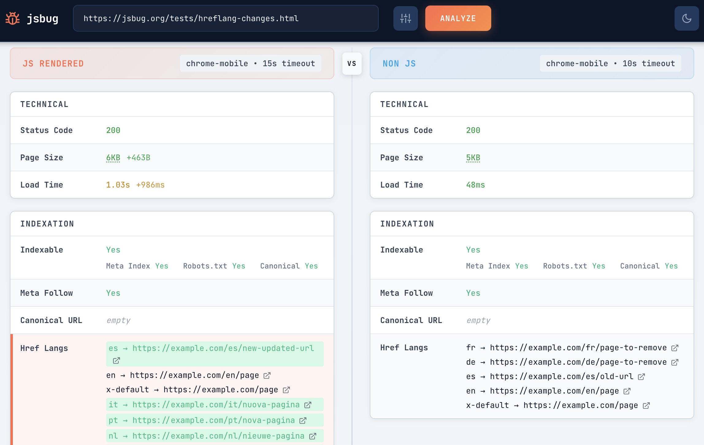

# JSBug

JSBug is a diagnostic tool for analyzing JavaScript rendering behavior and its impact on SEO and content delivery.

It fetches a URL twice: once with JavaScript enabled (rendered) and once without (raw HTML). 
You see both results side-by-side, making it easy to spot what JavaScript changes.
You can also compare two rendered versions with different settings: desktop vs mobile user agent, short vs long timeouts, 
with or without images. This helps you understand how rendering conditions affect your page content.

Try it [https://jsbug.org](https://jsbug.org)

JSBug is intended for technical SEOs, frontend engineers, and platform teams who need deterministic, 
inspectable insights into how pages actually render under real-world bot and browser conditions.



## The problem

Modern JavaScript pages are complex and fragile. 
A rendering issue can affect how Googlebot indexes your content and hurt organic rankings without you knowing.
AI search makes this worse. ChatGPT, Perplexity, and Claude fetch raw HTML without executing JavaScript. 
If your important content loads via JS, AI bots won't see it.


### SEO metadata
- Title and meta description
- Canonical URL
- Meta robots and X-Robots-Tag
- Hreflang tags
- Indexability status with robots.txt check

### Content
- H1, H2, H3 headings
- Body text with word count
- Text-to-HTML ratio
- Structured data (JSON-LD)

### Links and images
- Total count with internal/external breakdown
- Links and images added or removed by JavaScript
- Link attributes: nofollow, UGC, sponsored
- Image alt text coverage

### Technical
- HTTP status code
- Page size
- Load time
- Redirect chain

### JavaScript debugging (rendered view only)
- Network requests with status, size, and timing
- Console logs, warnings, and errors
- Page lifecycle events (DOMContentLoaded, load, networkIdle)
- Full rendered HTML

### UI
- Mobile friendly
- Dark theme!

## Self-hosted setup

### Backend

```bash
cd backend
go mod download
make build
./bin/jsbug -c config.yaml
```

Server runs on `http://localhost:9301`

### Frontend

```bash
cd frontend
npm install
npm run dev
```

Dev server runs on `http://localhost:5173`

## Tech stack

| Component | Technology |
|-----------|------------|
| Backend | Go, chromedp, goquery |
| Frontend | React 19, TypeScript, Vite |
| Browser | Headless Chrome via DevTools Protocol |

## License

MIT
